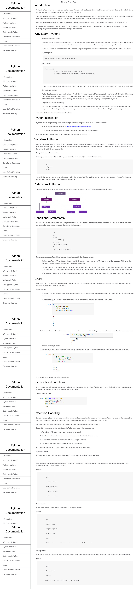

# Responsive Web Design: Technical documentation page

> Welcome my project "Responsive Web Design: Technical documentation page", built with html and css. 
The purpose of this exercise is to make use of responsive web design principles in order to make the website responsive. In particular, media queries are used extensively.
Please enjoy and leave a comment.

# Screenshot

## Live Demo
[Live Demo Link](https://rawcdn.githack.com/alvarorf/FCC-ResponsiveWebDesign-technicalDocumentationPage/aefda5a70c3aead5a8444e7648ce9f48d0f48e0c/index.html)

## Getting Started

Simply download the zip and decompress. Once decompressed, double click or open index.html in any web browser. 

## Authors

👤 **Alvaro Ruiz**

- Github: [@alvarorf](https://github.com/alvarorf)
- Twitter: [@aaruizf](https://twitter.com/aaruizf)
- Linkedin: [linkedin](https://www.linkedin.com/in/alvaro-r-22810915a/)

## 📝 License

This project is for Freecodecamp's curriculum purposes.